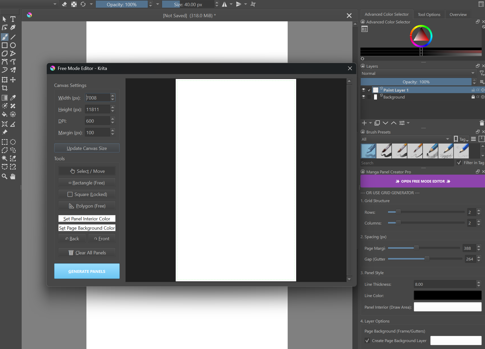

# Manga Panel Creator Pro for Krita

**Manga Panel Creator Pro** is a high-performance, professional tool designed for comic and manga artists using Krita. It automates the tedious process of creating panels, folders, and masking layers, allowing you to focus purely on your art.

new update 01/29/26: Now you can create panels with columns of asymmetrical numbers of rows, only in a rectangular shape, using a button that says "custom".
---

🛠 Installation
The easiest way to install the plugin is using the built-in Krita importer:

Download this repository as a ZIP file (Click the green Code button > Download ZIP).

Open Krita.

Go to the top menu: Tools > Scripts > Import Python Plugin...

Select the ZIP file you just downloaded.

---

## 💖 Support & License

This project is licensed under the **MIT License**. It is free to use, modify, and distribute for personal or commercial projects.

If this tool makes your workflow faster and more useful, consider supporting future development:

| Support the Project | Link |

---
*Created with passion for the Krita community of reddit.*
